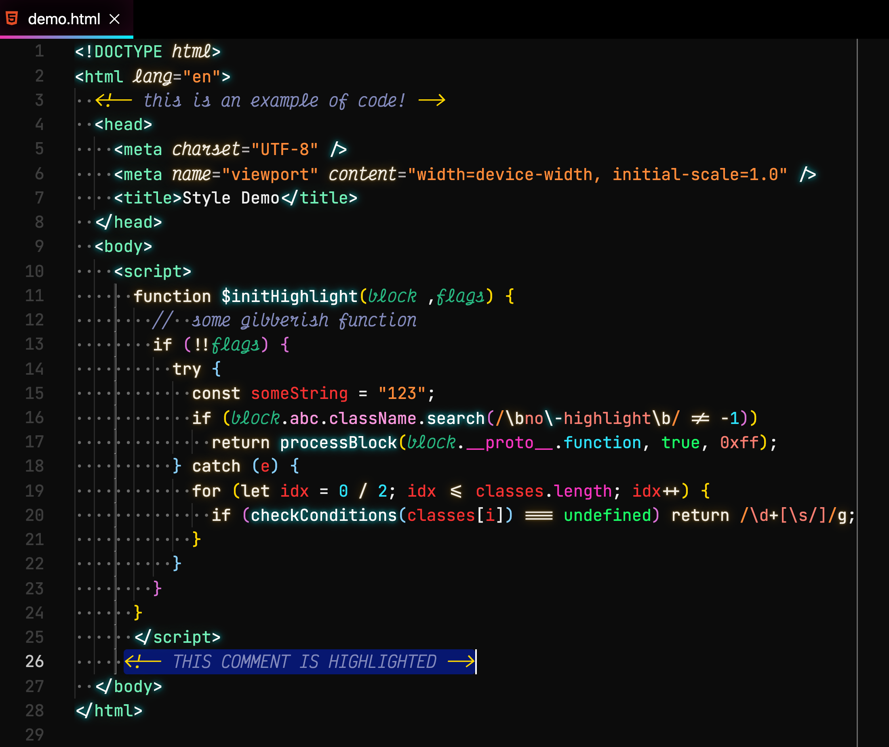

# Dark SynthWave '84 - VS Code theme


This is an amalgamation between two themes, [Lukin Theme](https://marketplace.visualstudio.com/items?itemName=lukinco.lukin-vscode-theme)
& [Synthwave '84](https://marketplace.visualstudio.com/items?itemName=RobbOwen.synthwave-vscode)
plus a few tweaks of my own.

Do you like the theme Synthwave '84? Do you wish there was a dark version of it?
I present Dark SynthWave 84



## But...why?
I wanted something easier on my eyes.

## Installation
To begin with, [install the base theme from the VS Marketplace](https://marketplace.visualstudio.com/items?itemName=AaronYoung.dark-synthwave-vscode). This is the way Dark SynthWave '84 is intended to be used day-to-day. If you want to enable the gratuitous 80s glow, it needs a little extra work to get it going.

### Disclaimer
VS code doesn't natively support text effects and as a result, the glow is experimental. It's likely to be buggy and, whilst it looks rad, it isn't intended for extended use. To enable the glow, the extension has to modify the internal files of VS Code, so use with caution. Should something go wrong, you can disable the glow by following the instructions below. If for any reason you can't open VS Code, you can fix the issue with a fresh install of VS Code.

If you do decide use the glow effect, you do so at your own risk. Bring your Sunglasses. Here be (laser)dragons.

### To enable the glow

Firstly, if you are a Windows user, you may need to run VS Code with administrator privileges. For Linux and Mac users, Code must not be installed in a read-only location and you must have write permissions.

To activate the glow, Set your active colour theme to Dark SynthWave '84 - as now the glow is only active when the base theme is selected. Open your command palette with `Ctrl + Shift + P` or `Shift + ⌘ + P` and choose "__Dark Synthwave '84: Enable Neon Dreams__". It will prompt you to restart, and when you do the lights should be on 😲

Note: In the name of simplifying the install process and mitigating update-related issues, the new version of Dark SynthWave '84 doesn't use a custom CSS file anymore.

#### To customise the glow brightness
In your `settings.json` add the key:
```
"darkSynthwave84.brightness": "0.45"
```
The value should be a _float value_ from 0 to 1, where 0.0 is fully transparent. The default brightness is 0.45. To avoid eye strain, avoid using higher brightness values for extended periods of time.

To see the changes, you need to rerun the activation function. Open your command palette with `Ctrl + Shift + P` or `Shift + ⌘ + P` and choose "__Dark Synthwave '84: Enable Neon Dreams__".

Note: Changing the brightness currently only affects the opacity of the glow, the text will remain white (that may change in future updates). If you want to disable the glow effect but retain the chrome updates, see below.

#### To enable editor chrome updates, but disable glow
In your `settings.json` add the key:
```
"darkSynthwave84.disableGlow": true
```
To see the changes, you need to rerun the activation function. Open your command palette with `Ctrl + Shift + P` or `Shift + ⌘ + P` and choose "__Enable Neon Dreams__".

### To remove corruption warning and [unsupported] from title-bar
Because enabling the glow modifies core files, VS code will interpret this as the core being 'corrupted' and you may see an error message on restarting your editor. You can safely dismiss this message, or remove it entirely with the [Fix VSCode Checksums](https://marketplace.visualstudio.com/items?itemName=lehni.vscode-fix-checksums 'Fix VSCode Checksums') extension.

Upon installation of 'Fix VSCode Checksums', open the command palette and execute `Fix Checksums: Apply`. You will need to completely restart VSCode after execution, reopening without fully exiting might not be enough.

## Updates
Every time you update VS code, you will need to repeat this step to re-enable the glow.

## Disabling the glow and uninstallation
The glow effect started as a joke and was never intended for long-term coding sessions. If you want to turn it off, you can disable it at any time by opening your command palette with `Ctrl + Shift + P` or `Shift + ⌘ + P` and choose "__Disable Neon Dreams__".

### Font
I haven't included a font in this release as I know that it's a very personal preference. The font I use (that is seen in the image above) is actually two fonts. [JetBrains Mono](https://www.jetbrains.com/lp/mono/), which I recommend if you're a fan of ligatures. Well guess what, there is a second font, just for *italics*, [Victor Mono](https://rubjo.github.io/victor-mono/). See how to set up two fonts on my blog post, [Using Two Fonts in VS Code](https://aaronyoung.dev/blog/2021-01-24-vscode-dual-fonts/)

## Compatibility
This theme is still **very much a work in progress**. I primarily develop in HTML & CSS, JS, React so, whilst those language sets should look pretty good, there will likely be issues for other languages. I'll work on adding more support as I go. If you find anything glaringly wrong, raise an issue and I'll try to fix it as soon as I can.

## Contributing
I'm really happy to consider any contributions to this theme. Before you make any changes, [please read the contribution guide](https://github.com/brainomite/dark-synthwave-vscode/blob/master/CONTRIBUTING.md).

## Thanks
Lastly, I couldn't have made this if it weren't for the fantastic work of[Robb Owen](https://marketplace.visualstudio.com/publishers/RobbOwen) for their theme [Synthwave '84](https://marketplace.visualstudio.com/items?itemName=RobbOwen.synthwave-vscode) theme & [Lukin Co](https://marketplace.visualstudio.com/publishers/lukinco) for their [Lukin Theme](https://marketplace.visualstudio.com/items?itemName=lukinco.lukin-vscode-theme). 🙏

